# Magento 2 Connector for Odoo 19

Odoo talks **straight to Magento 2 over its REST API**. There is no middleware to deploy,
no second database, no extra set of credentials — and every synchronisation that fails is
recorded on a screen inside Odoo instead of in a container log.

| | |
|---|---|
| **Odoo** | 19.0 |
| **Magento** | 2.4.x |
| **Depends** | `base`, `account`, `stock`, `sale`, `sale_stock` |
| **License** | LGPL-3 |
| **Author** | Sebastian Martin Artaza Saade — [artaza.net](https://www.artaza.net) |

---

## What it syncs

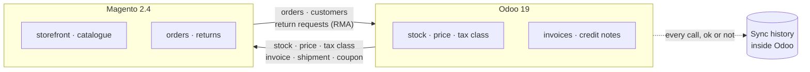

**Odoo owns** stock, prices and the fiscal documents. **Magento owns** the storefront and the
orders. The connector keeps the two in step and tells you, in Odoo, whenever it could not.

---

## Features

### Odoo → Magento

- **Stock per warehouse.** Each Odoo warehouse maps to one Magento MSI *inventory source*;
  warehouses sharing a source are summed. A warehouse with no source is not synced — never
  guessed. Sent in batches you size.
- **Base price**, tax included, for stores running `Catalog Prices = Including Tax`.
- **Product tax class**, auto-matched by rate (see below).
- **Negotiated total** — see below.
- **Fulfillment** — validate the delivery in Odoo and Magento is invoiced and shipped, so the
  order reaches `complete` and the customer gets the shipping mail.

### Magento → Odoo

- **Orders**, pulled on a self-healing `updated_at` cursor you can see and edit. Paid orders
  become a **confirmed sale**; offline orders still awaiting payment become a **quotation** to
  negotiate. The customer is upserted along the way.
- **Return requests (RMA)**, pulled into a first-class Odoo record with its own state machine.

### Negotiating the total

B2B prices get agreed on the phone. Odoo only computes **forward** — unit price × quantity,
minus a discount, gives a total — so there is no native way to say *"this order is 95,000"*.
A uniform discount percentage rounds per line and lands a few pesos off the round number the
customer was quoted.

**Adjust total** takes the figure you agreed on, scales every line's tax-included unit price by
the required ratio, and **absorbs the rounding residual on the last line**, so `amount_total`
lands on *exactly* what you typed. Above 1 it is a surcharge (a fee for a 90-day cheque), below
1 a discount.

| | |
|---|---|
| 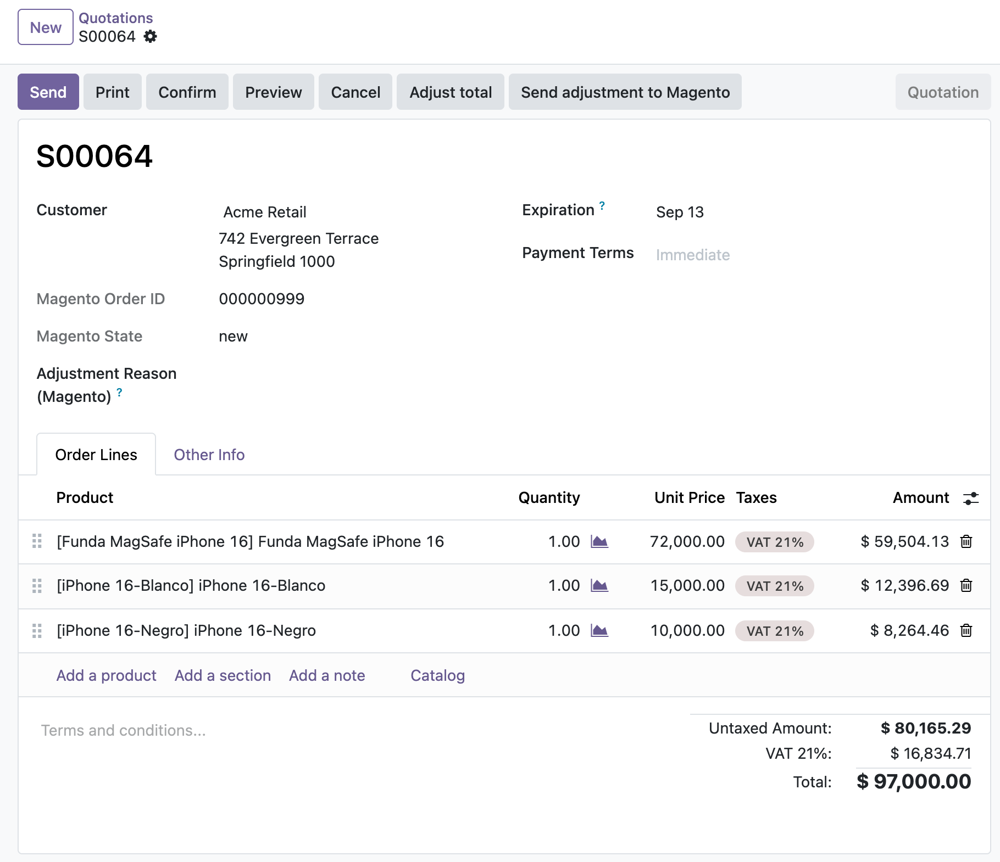 | The order arrives as a quotation: 97,000. |
| 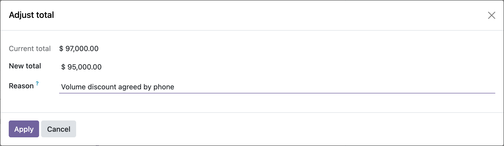 | Type the agreed total and the reason. |
| 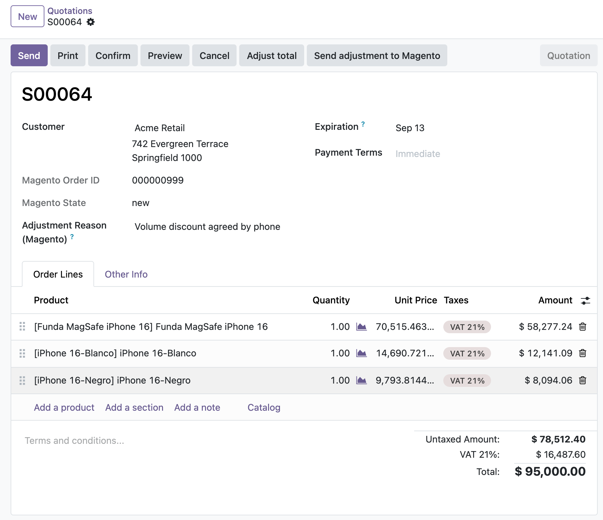 | Prorated across the lines, total exactly 95,000. |

**Send adjustment to Magento** then pushes the agreed total and your reason to the storefront so
the customer sees what was arranged. They are informational fields — Magento's balances are never
touched, and the fiscal document is the Odoo invoice. The reason is mandatory: the customer reads it.

### Returns, end to end

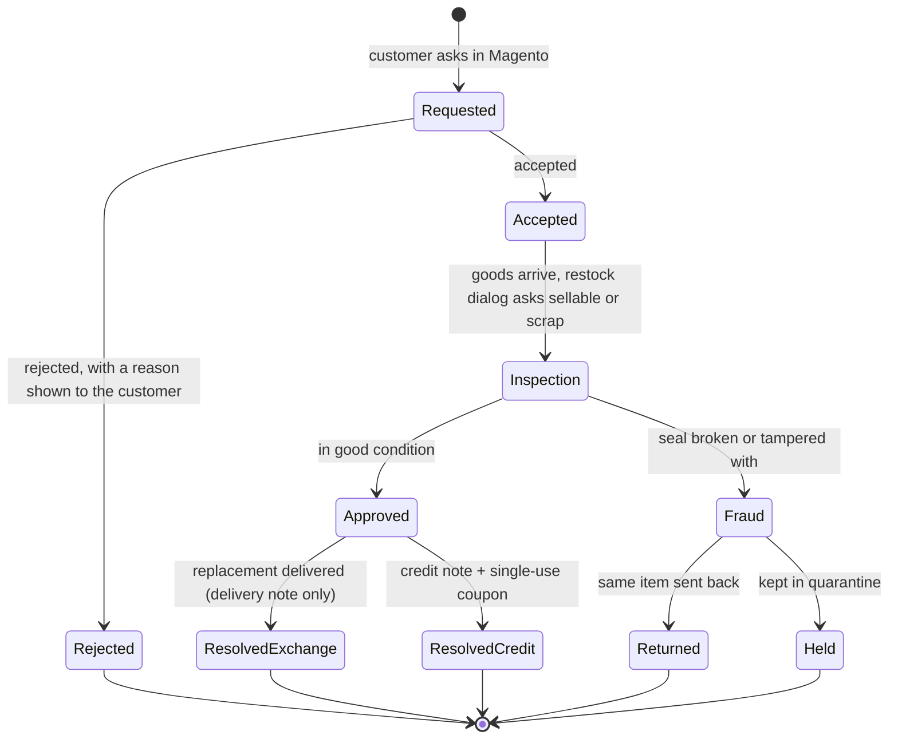

Every transition pushes the new status **and your message** back to the storefront. Resolving
as credit issues the reversal through Odoo's native reversal wizard — so localisations that
number credit notes separately get the right document type — and mirrors the amount into
Magento as a **native single-use coupon**, one per return, idempotent on retry.

### Configuration: names, never ids

Internal ids are not portable — the id of a tax in your test database is not the id in
production, and a wrong one syncs the wrong rate *silently*. So the module never asks for one.

Press **Bring sources from Magento** / **Auto-match by rate** and you pick from lists the
Magento API fills in. Auto-match reads `taxRules` and `taxRates`, works out which class applies
which percentage, and pairs it with the Odoo tax of the same rate — **only when the answer is
unambiguous**. Two classes at 21%, or one class with two rates, is left for a human.

> ⚠️ **The taxes must already exist on both sides.** This module **does not create taxes**: not in
> Odoo, and not in Magento. It only *relates* what is already there. So every rate you sell at has
> to be configured in **both** systems first, with the **same percentage** — an `IVA 21%` in Odoo
> and a Magento product tax class whose rules charge 21%.
>
> That is what makes the match automatic: the rate is the only thing the two systems agree on. If
> a rate exists in Odoo but no Magento class applies it, the tax stays **pending** and the products
> carrying it never get their tax class pushed — reported in the sync history, never guessed.
>
> Two further conditions: the Magento class must apply a **single** rate (a class charging two
> different rates cannot be matched automatically and has to be picked by hand), and the Odoo tax
> must be marked **Included in Price**, because Magento sends gross prices.

### Sync history

> An integration is not judged by whether the happy path works — that is solved in a day.
> It is judged by how long it takes a human to understand why it *didn't*.

Every run lands in **Magento ▸ Sync History**: what was sent, what came back, which records went
through and which did not, with the message Magento or Odoo actually returned.

- Failures keep the detail **per item** and are **never purged automatically**. Successes
  collapse to a single line and are purged after N days (0 = never).
- The row is written on **its own database transaction**, so a failure that rolls the main one
  back cannot erase its own trace.
- **Retry** from the screen: pushes are re-queued for the next run; failed *imports* are
  re-fetched immediately by their Magento number, because the cursor has already moved past them.

---

## Screens

| | |
|---|---|
| 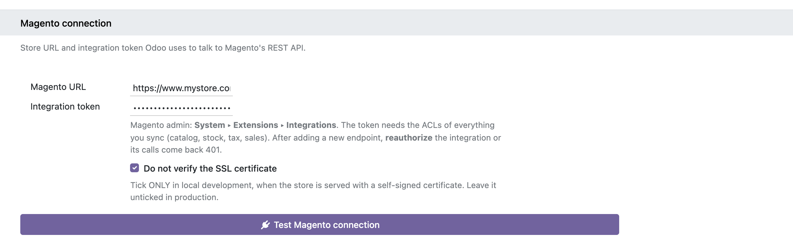 | **Connection** — a URL and an integration token. |
| 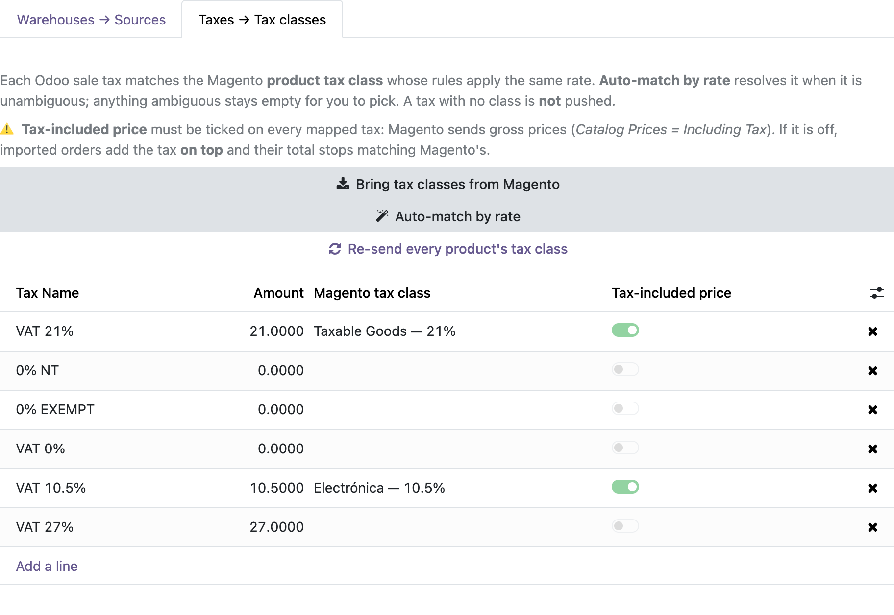 | **Mapping** — chosen from lists, never typed. |
| 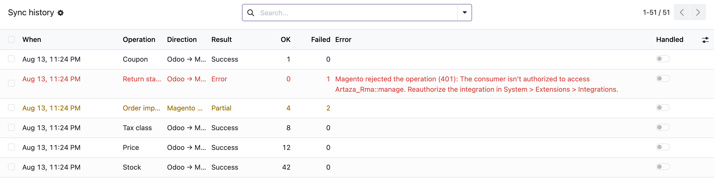 | **Sync history** — one row per run. |
| 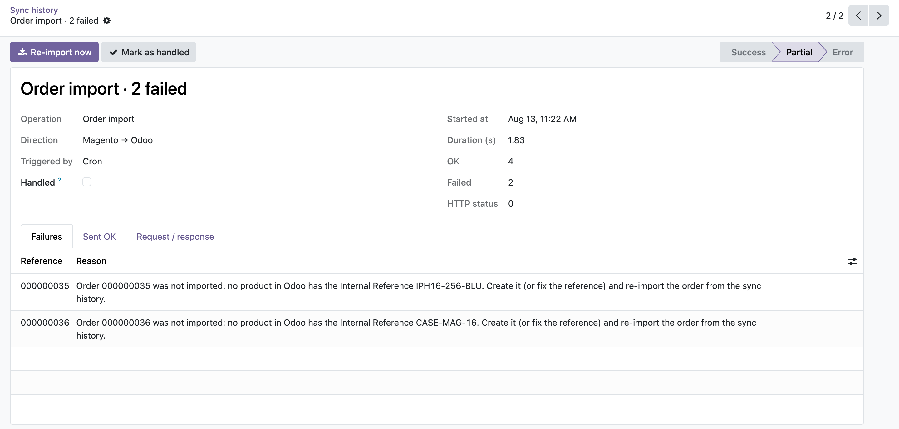 | **A failure** — reason per record, and one button to replay it. |
| 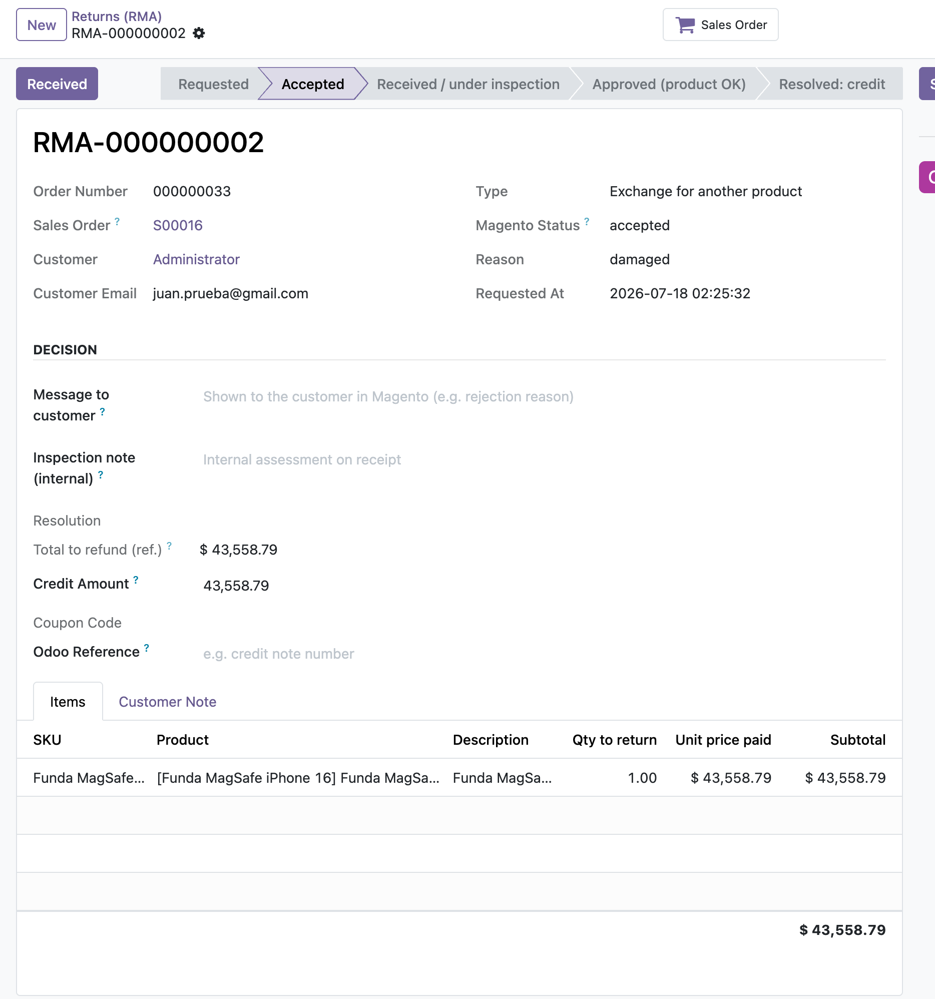 | **Returns** — the decision is made in Odoo. |
| 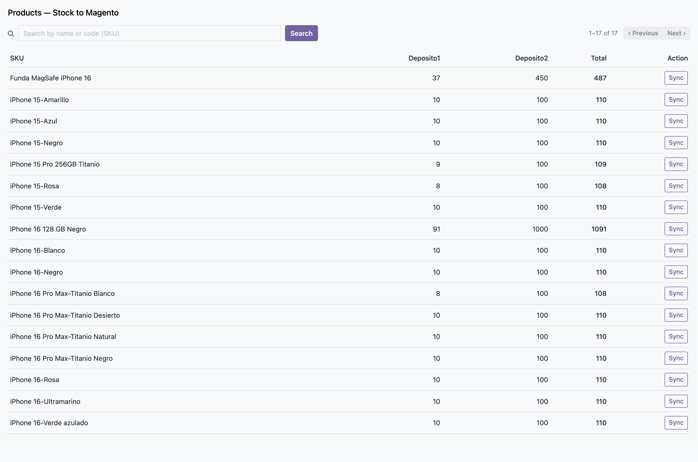 | **Stock** — per warehouse, per SKU. |

---

## Install

```bash
# 1. drop the module in your addons path, then
./odoo-bin -d <database> -i artaza_magento_connect

# upgrading an existing install
./odoo-bin -d <database> -u artaza_magento_connect
```

## Tests

195 tests, 96% statement coverage. Magento is always mocked at the client
boundary, so the suite needs no reachable store and opens no socket.

```bash
./odoo-bin -d <testdb> -i artaza_magento_connect --test-enable \
           --test-tags /artaza_magento_connect --stop-after-init

# with coverage
python3 -m coverage run --source=<path>/artaza_magento_connect \
        odoo-bin -d <testdb> -i artaza_magento_connect --test-enable \
        --test-tags /artaza_magento_connect --stop-after-init
python3 -m coverage report --omit="*/tests/*"
```

## Configure

1. **Magento** — create an integration (*System ▸ Extensions ▸ Integrations*) whose ACL covers
   what you intend to sync, activate it and copy the **access token**.
2. **Odoo** — *Settings ▸ Magento Connect*: paste the store URL and the token, then
   **Test Magento connection**. It answers with the store views it found.
3. **Mapping** — **Bring sources from Magento**, then give each warehouse its source.
   **Bring tax classes**, then **Auto-match by rate** and resolve anything left pending.
4. **Orders** — list your payment method codes: *immediate-payment* ones become confirmed
   sales, *payment-pending* ones become quotations. Set the shipping tax.
5. **Cursors** — set *Import orders/returns updated since* to the moment you want history to
   start. Leave it at the default to import everything.
6. **Crons** — every import and push ships **disabled**. Turn on the ones you want and set
   their frequency.

> ⚠️ After adding a new endpoint or ACL in Magento, **reauthorize the integration** — otherwise
> its calls come back `401` and only that one feature quietly stops working.

---

## Requirements and limitations

Most of the connector speaks Magento's **native** REST API and needs nothing installed on the
store. Four features call endpoints Magento Community does not provide and need the companion
Magento modules — both free, open source (OSL-3.0) and installable with Composer:

```bash
composer require artaza/module-odoo-integration   # tax class + negotiation endpoints
composer require artaza/module-rma                # returns (Magento CE has no native RMA)
```

| Package | Covers | Links |
|---|---|---|
| `artaza/module-odoo-integration` | Tax class push, negotiated total | [Packagist](https://packagist.org/packages/artaza/module-odoo-integration) · [GitHub](https://github.com/martinartaza/magento_odoo_integration) |
| `artaza/module-rma` | Return requests and status | [Packagist](https://packagist.org/packages/artaza/module-rma) · [GitHub](https://github.com/martinartaza/magento_rma) |

You only need the one that covers what you actually use — stock, prices, orders, invoices and
shipments all work against a stock Magento install:

| Feature | Endpoint | Requires |
|---|---|---|
| Stock per source (MSI) | `inventory/source-items` | ✅ Native Magento |
| Base price | `products/base-prices` | ✅ Native Magento |
| Order import | `orders` + searchCriteria | ✅ Native Magento |
| Invoice & shipment | `order/{id}/invoice`, `/ship` | ✅ Native Magento |
| Credit coupon | `salesRules` + `coupons` | ✅ Native Magento |
| Tax class auto-match | `taxClasses`, `taxRules`, `taxRates` | ✅ Native Magento |
| Push the product tax class | `products/tax-class` | ⚠️ `module-odoo-integration` |
| Negotiated total | `orders/{id}/negotiation` | ⚠️ `module-odoo-integration` |
| Return requests | `rma` | ⚠️ `module-rma` |
| Return status push | `rma/{id}/status` | ⚠️ `module-rma` |

Other things worth knowing before you commit:

- **Products are matched by SKU.** The Magento `sku` must equal the Odoo **Internal Reference**.
  An order whose SKU is unknown to Odoo is **refused**, not imported half complete — the reason
  names the missing reference, and you re-import it from the history once the product exists.
- **Taxes must be price-included.** Magento sends gross prices. If a mapped Odoo tax is not
  marked *Included in Price*, imported totals come out inflated by that rate. The auto-match
  screen warns about this explicitly — do not dismiss it.
- **The connector does not create products or categories** in either direction. It syncs stock,
  price and tax class for products that already exist on both sides.
- **The token lives in Odoo**, in `ir.config_parameter`. Anyone with system settings access can
  read it.

---

## Troubleshooting

| Symptom | Where to look |
|---|---|
| A feature stopped working, the rest is fine | **Sync History** — look for `401` / *not authorized*. Almost always an ACL added in Magento without reauthorizing the integration. |
| An order never arrived | Sync History, filtered on *Order import*. If it was refused, the reason names the SKU. Fix it, then **Re-import now**. |
| An imported total does not match Magento | The order's tax is not *Included in Price*. Fix the tax, then re-import the order. |
| Something was missed before the module was watching | Move the cursor back in *Settings ▸ Magento Connect ▸ Orders*. Re-reading never duplicates: imports are create-once by Magento number. |
| Nothing syncs at all | The crons ship disabled. Turn them on in Settings. |

---

## License

LGPL-3. See `LICENSE`.
